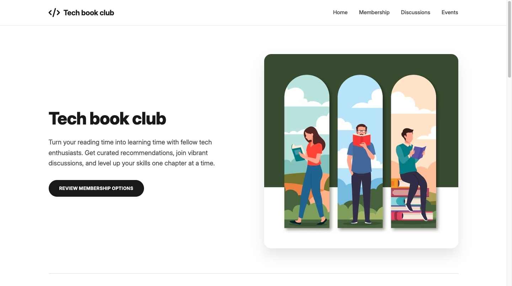
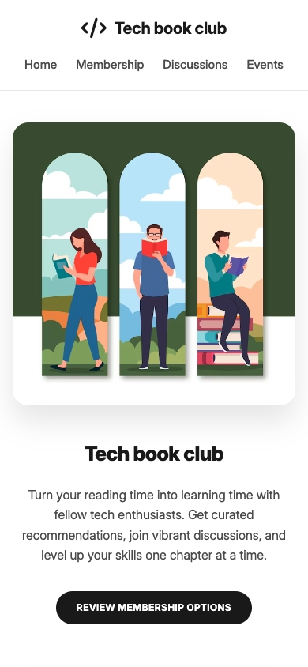

# Tech book club landing page
Project link: https://tech-book-club-landing-page-phi.vercel.app/

## Description
A modern landing page for an IT professionals' book club.

## Features
1. Fully responsive (from 320px to 4K)
2. Button and card animations on hover

## Installation and configuration
1. Clone repositories
- git clone git clone https://github.com/selikon13/tech-book-club.git
- cd tech-book-club
- code .
2. Via Live Server (https://github.com/ritwickdey/vscode-live-server-plus-plus )

- Install the Live Server extension for VS Code (or any other code editor)
- Right click on index.html ☞ "Open with Live Server"
- Will automatically open in browser at http://localhost:5000
3. Via Python server
- python3 -m http.server 8000
- Open in your browser: http://localhost:8000

## Screenshots
### Desktop

### Mobile

## Technologies
- Structure: HTML5 
- Style: CSS3 with custom properties (CSS variables)
- Flexbox / Grid
- Fonts: Awesome 6, Google Fonts (Inter)

## Contacts
- Email: fnaffi095@gmail.com
- GitHub: selikon13 (https://github.com/selikon13)